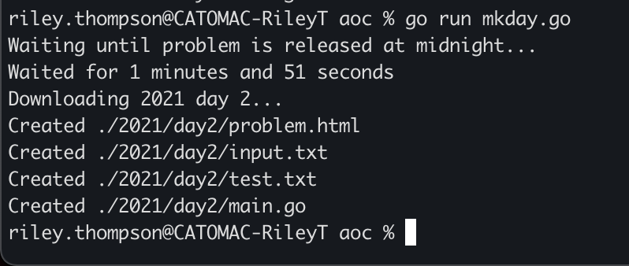
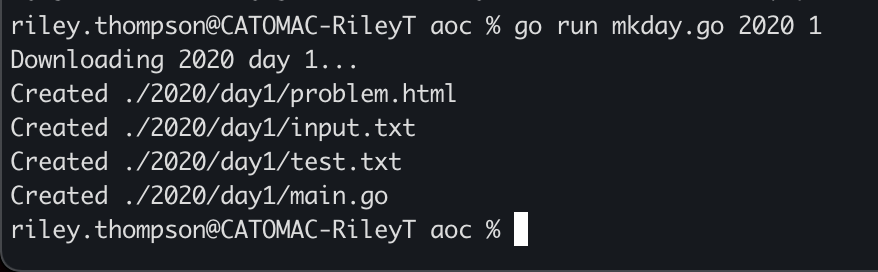

# aoc
Advent of Code tools and solutions.

### **Usage:**
NB: Must have environment variable `AOC_TOKEN` set to your AoC API session token.

**Submission Statistics**\
Running\
`./aoc stats `\
checks the number of correct submissions every minute for the first hour and then every hour for the rest of the day and writes the output to `<day>stats.csv`.

---

**Automated Problem Fetching**\
Running\
`./aoc mkday <year> <day>`\
will generate\
`aoc/<year>/day<day>/problem.html`: The problem specification from the AoC API.\
`aoc/<year>/day<day>/input.txt`: The problem input from the AoC API.\
`aoc/<year>/day<day>/test.txt`: An empty file for test input.\
`aoc/<year>/day<day>/main.go`: An AoC boilerplate Go file.\
and open the problem specification with\
`open aoc/<year>/day<day>/problem.html`

The default values are:
- day:   next day
- year:  current year

So if a day is not given, it will wait until a new problem is released at midnight and then generate the files.

---

**Automated Submission**\
Running\
`./aoc submit <level> <year> <day>`\
will automatically submit the output of\
`go run main.go <level> input.txt`\
to the AoC API. It then generates the submission response locally and opens it with\
`open aoc/<year>/day<day>/submission.html`

The default values are:
- level: 1
- day:   current day
- year:  current year

