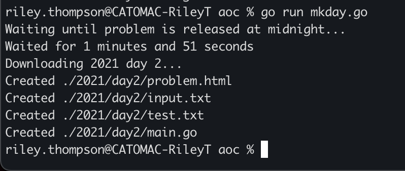
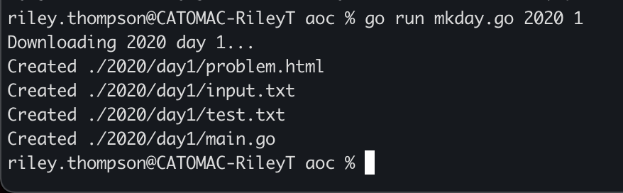

# aoc
Advent of Code Solutions.

**Usage:**\
NB: Must have environment variable `AOC_COOKIE` set to your AoC API cookie.

Running\
`go run mkday.go <year> <day>`\
will generate

`aoc/<year>/day<day>/problem.html`: The problem specification from the AoC API.\
`aoc/<year>/day<day>/input.txt`: The problem input from the AoC API.\
`aoc/<year>/day<day>/test.txt`: An empty file for test input.\
`aoc/<year>/day<day>/main.go`: An AoC boilerplate Go file.

If a year and day are not given, then it will wait until a new problem is released at midnight and then generate the files.

